# ポートフォリオ
# 1.分散型図書管理システム

## プロジェクトの概要
#### プロジェクトの内容  
本プロジェクトは、ある会社のビル内で分散して保管されている図書を管理するものです。図書の登録、貸出、返却などの機能を提供します。
#### プロジェクトの行程
* 開発開始　2024/07/12
* 設計　~2024/07/19
* 開発　~2024/08/09
* デザイン　~2024/08/20
* テスト　~2024/09/03現在作業中

## 開発環境

本プロジェクトは、WindowsOSのローカル環境で開発しました。

推奨ブラウザはGoogle Chromeです。

#### 使用言語（フレームワーク・ライブラリ）
* Python（Django）
* JavaScript（jQuery、Quagga、fullcalendar）
* HTML/CSS、Bootstrap

#### システム構成
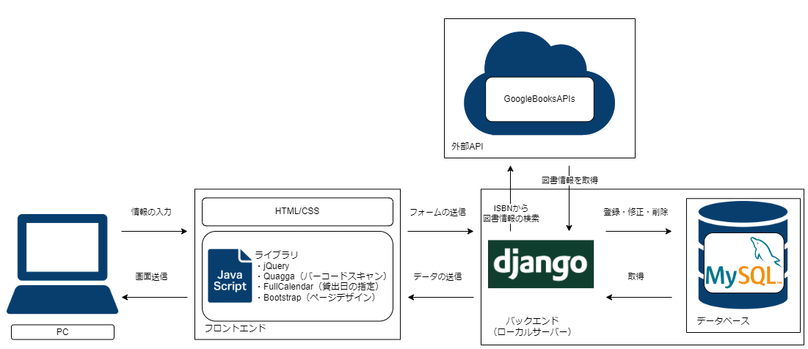

#### 設計図
* ER図

  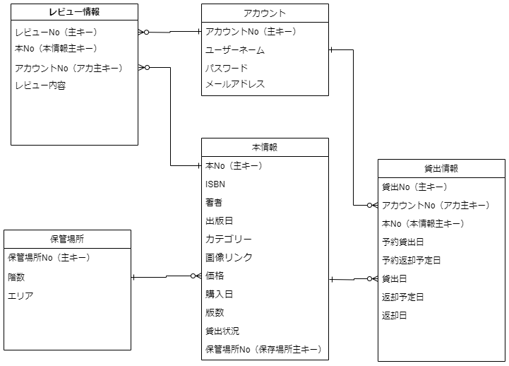

* ユースケース図

  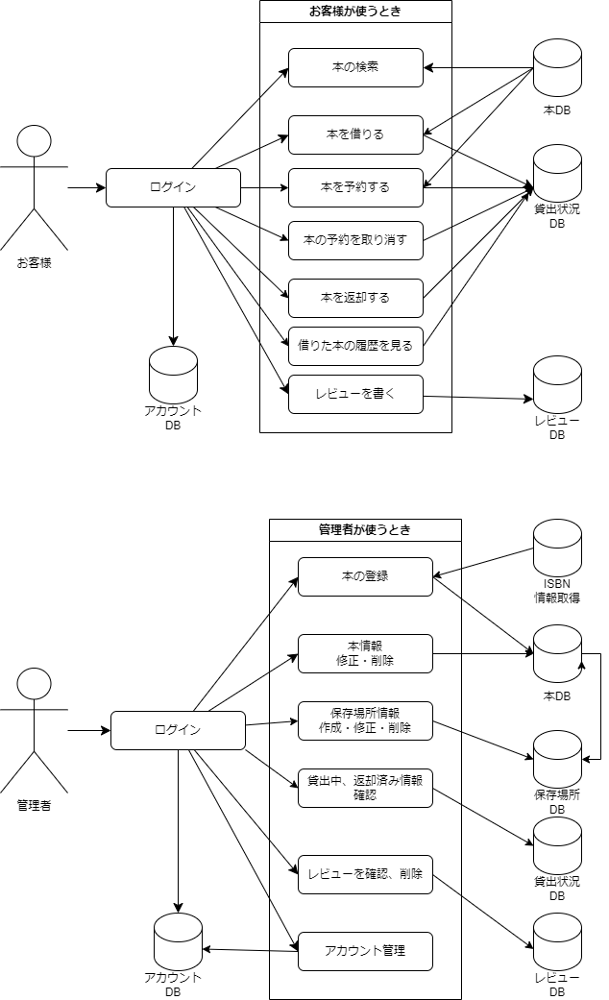
* 画面遷移図
  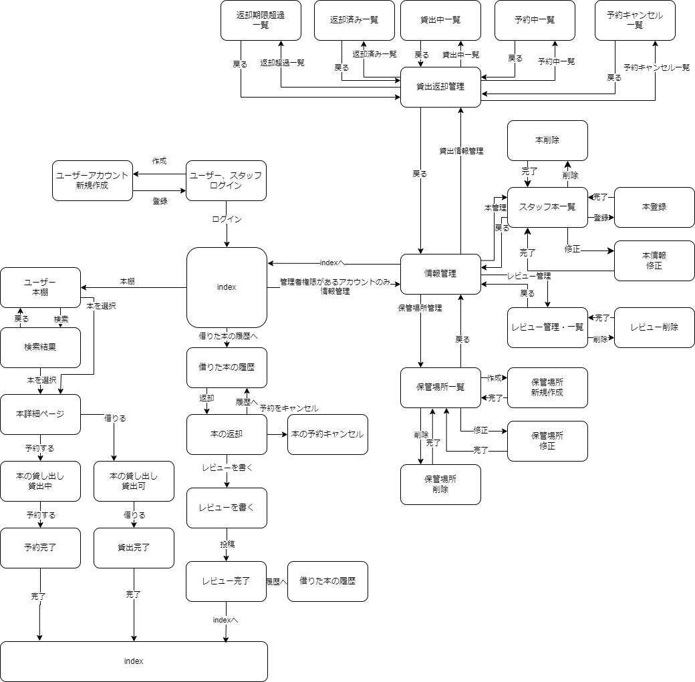

## 機能

#### 管理者側
* ISBNから図書情報を取得し、登録
* 図書の管理
* 保管場所の管理
* レビューの管理
* 貸出、返却の管理

#### ユーザー側
* 図書の検索
* 図書の予約、予約キャンセル
* 図書のレンタル、返却
* 図書のレビューを書く
 
## デモ

#### 図書を登録する

図書を新規登録する画面です。デバイスカメラから本のISBNコードを読み取り、GoogleBooksAPIsを用いて図書情報を自動入力できます。

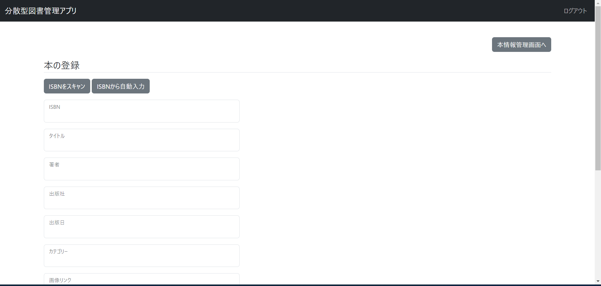

* ISBNコードをスキャン
  
  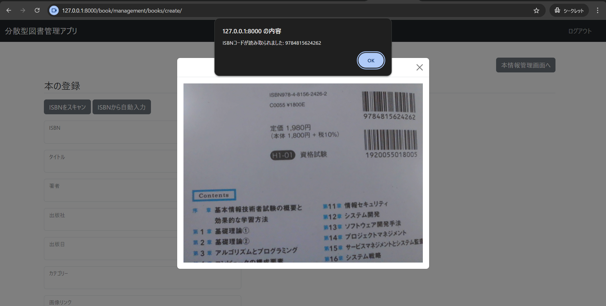
  
* ISBNからGoogleBooksAPIsを用いて、図書情報を取得
  
  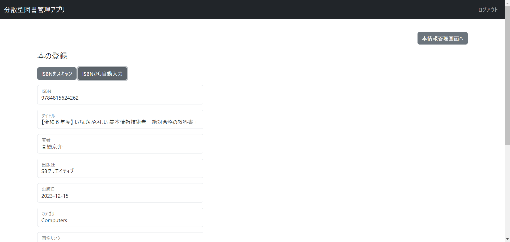

#### 登録した図書を確認する

登録された図書が確認できる画面です。管理者が「情報管理」から確認できます。

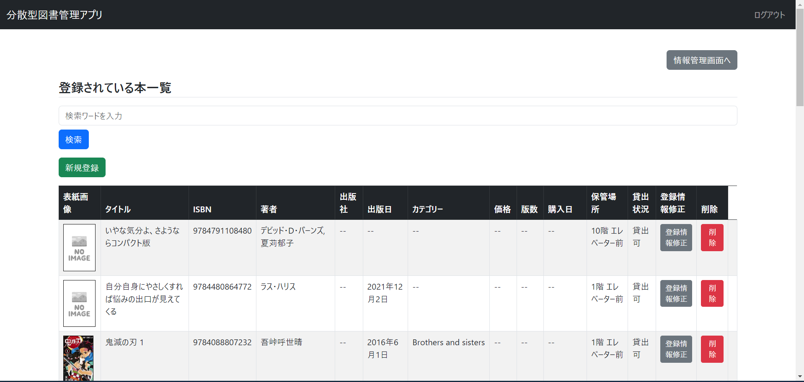

* 検索機能
  
  先ほど登録した本が問題なく反映されていることが確認できます。
  
  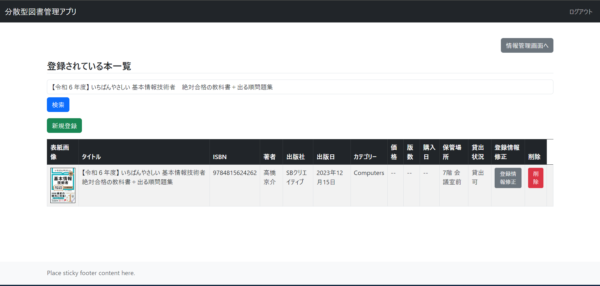

#### ユーザー本棚

ユーザーが登録されている図書を閲覧・検索できる画面です。図書画像を選択することで詳細画面や、貸出画面に進むことができます。

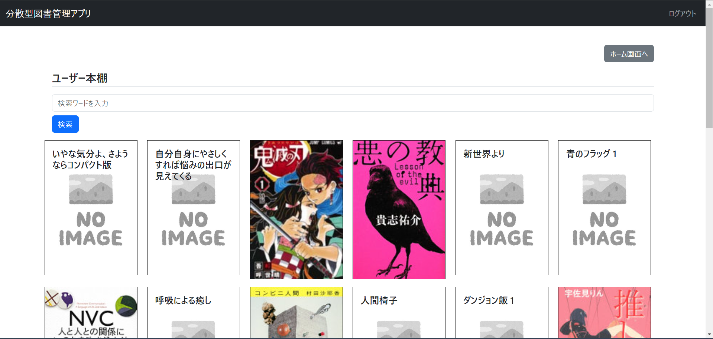

* 検索機能

  登録した図書一覧同様、ユーザー本棚でも検索ができます。

  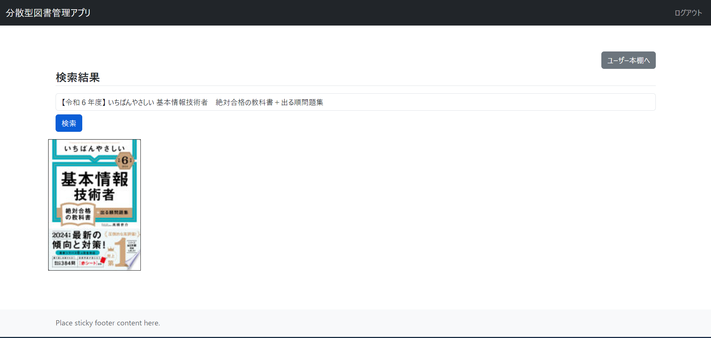

#### 図書を借りる

ユーザー本棚から選択した図書の詳細画面から、本を借りることができます。借りたい本が貸出中の場合は予約できます。

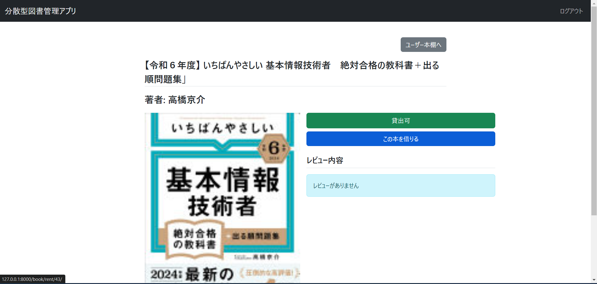

* 貸出画面

  カレンダーから日付を選択することで、貸出日と返却予定日を設定することができます。貸出や予約をされている日付は赤く表示され選択できません。

  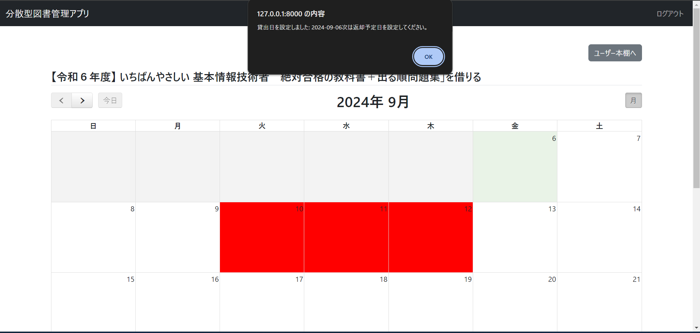
  
* 貸出完了画面

  貸出処理が完了すると、貸出日と返却予定日、そして本の保管場所が表示されます。ユーザは、この保管場所から借りた図書を持ち出すことができます。

  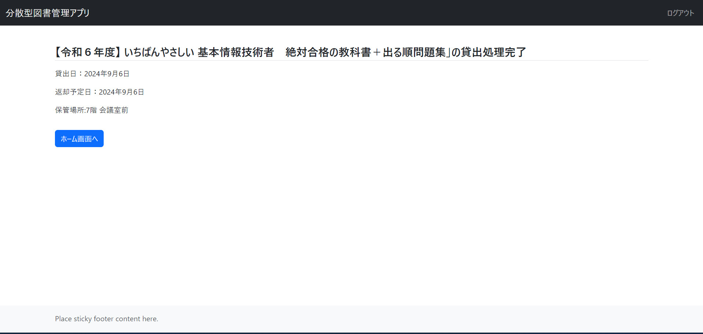

#### 貸出状況を確認する

貸出状況に応じて図書情報を閲覧できる画面です。管理者は情報管理の「貸出情報管理」から確認できます。

#### 図書を返却する

ユーザーは「レンタル一覧」から、貸出状況を確認できます。返却する本の右にある「返却する」から返却処理ができます。

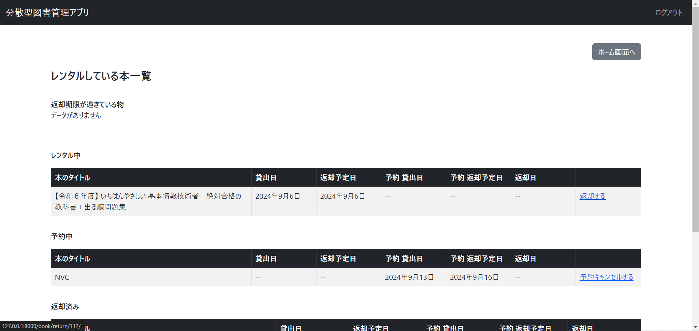

* レビューを投稿する

  返却処理が完了すると、レビュー投稿フォームへ遷移します。投稿せずホーム画面に戻ることもできます。

  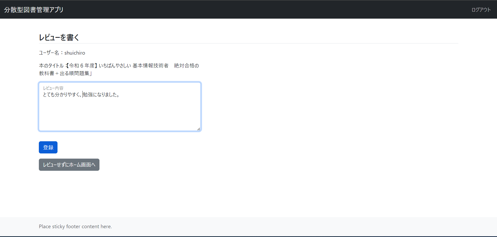

* レビュー投稿完了

  レビューを投稿すると、完了画面で内容を確認できます。

  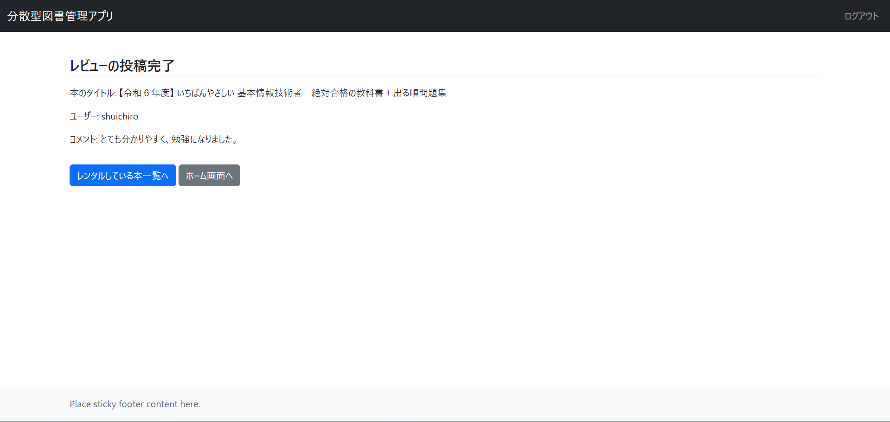

* 返却処理の反映

  貸出情報管理画面から返却処理が正常に行われたことが確認できます。

  

* レビュー情報の反映

  図書の詳細画面から投稿したレビューが確認できます。

  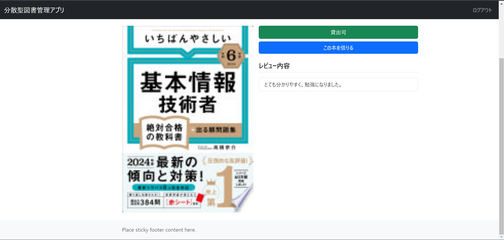

## 著者
 
* 作成者：代 脩一郎(Dai Shuichiro）
* 所属：就労移行支援施設Kaien大宮　訓練生
