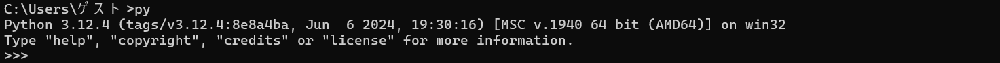

## プロジェクトの概要

1. #### プロジェクト名  
   分散型図書管理システム
2. #### プロジェクトの内容  
   本プロジェクトは、ビル内で分散して保管されている書籍情報を管理するものです。図書の登録、貸出、返却などの機能を提供します。
3. #### プロジェクトの行程
   * 開発開始　2024/07/12
   * 設計　~2024/07/19
   * 開発　~2024/08/09
   * デザイン　~2024/08/20
   * テスト　~2024/09/03現在作業中
 
## デモ

#### ユーザー本棚


#### 貸出状況管理画面


## 機能

#### 管理者側
* ISBNから本情報を取得し、登録
* 本の管理
* 保管場所の管理
* レビューの管理
* 貸出、返却の管理

#### ユーザー側
* 本の検索
* 本の予約、予約キャンセル
* 本のレンタル、返却
* 本のレビューを書く

<!-- 
## インストール方法

1. #### Pythonをインストールする。

   Pythonがすでにインストール済みの場合は、コマンドプロンプトまたはターミナルで「python」または「py」と入力すると、以下のような表示が出ます。
   

   インストールされていない場合は、以下の手順でインストールを進めてください

   #### Windowsの場合
   1. [Pythonの公式サイト](https://www.python.org/downloads/)にアクセスし、最新の安定版Pythonをダウンロードします。
   2. ダウンロードしたインストーラを実行し、以下の設定を行います.
      * 「Add Python to PATH」にチェックを入れます。
      * 「Install Now」をクリックします。
   3. インストールが完了したら、コマンドプロンプトを開き、以下のコマンドを実行してインストールが成功したことを確認します。
      ```bash
      python --version
      ```

   正しくインストールされていれば、Pythonのバージョンが表示されます。
   
   #### macOSの場合
   
   1. ターミナルを開き、Homebrewを使用してPythonをインストールします。
      ```sh
      brew install python
      ```
   2. インストールが完了したら、以下のコマンドでバージョンを確認します。
      ```sh
      python3 --version
      ```

   正しくインストールされていれば、Pythonのバージョンが表示されます。
   
3. #### MySQLをインストールする。

5. #### 仮想環境を作成し、アクティベートする。
   ```bash
   python -m venv venv

   # Unix/macOSの場合
   source venv/bin/activate

   # Windowsの場合
   venv\Scripts\activate
   ```
6. #### 依存関係をインストールする。
   ```bash
   pip install -r requirements.txt
   ```
 
## 使い方

## 注意点 
-->
## 著者
 
* 作成者：代 脩一郎(Dai Shuichiro）
* 所属：就労移行支援施設Kaien大宮　訓練生

 <!--
## ライセンス
ライセンスを明示する
 
"hoge" is under [MIT license](https://en.wikipedia.org/wiki/MIT_License).
 
社内向けなら社外秘であることを明示してる
 
"hoge" is Confidential.
-->
