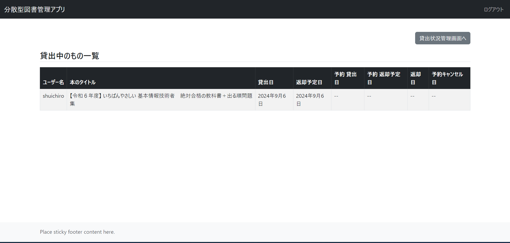

## プロジェクトの概要

1. #### プロジェクト名  
   分散型図書管理システム
2. #### プロジェクトの内容  
   本プロジェクトは、ビル内で分散して保管されている図書情報を管理するものです。図書の登録、貸出、返却などの機能を提供します。
3. #### プロジェクトの行程
   * 開発開始　2024/07/12
   * 設計　~2024/07/19
   * 開発　~2024/08/09
   * デザイン　~2024/08/20
   * テスト　~2024/09/03現在作業中
 
## デモ

#### ユーザー本棚

ユーザーが登録されている図書を閲覧・検索できる画面です。図書画像を選択することで詳細画面や、貸出画面に進むことができます。

#### 管理画面

保管場所や貸出状況などの閲覧・登録・修正・削除ができる画面です。下記画像は、現在貸出中の図書情報一覧を閲覧できる画面です。

## 機能

#### 管理者側
* ISBNから図書情報を取得し、登録
* 図書の管理
* 保管場所の管理
* レビューの管理
* 貸出、返却の管理

#### ユーザー側
* 図書の検索
* 図書の予約、予約キャンセル
* 図書のレンタル、返却
* 図書のレビューを書く

## 開発環境

## 著者
 
* 作成者：代 脩一郎(Dai Shuichiro）
* 所属：就労移行支援施設Kaien大宮　訓練生
